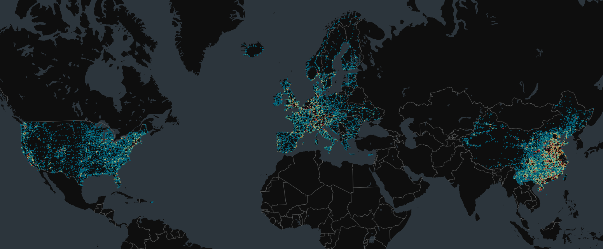

# Global Public Electric Vehicle Charging Station Data in 2022

We are glad to share the Global Public Electric Vehicle Charging Station Data in 2022, which contain public EV charging station locations in the US, China and Europe. 

> *Global Public Electric Vehicle Charging Station Data in 2022*

- For the US, we collected the location data of 46,548 EVCSs (with a sample rate of 87.02%) from the Alternative Fuels Data Center;
- For China, we collected the location data of 73,114 EVCSs (with a sample rate of 65.64%) from the AMAP, one of the largest online mapping service providers in China.
- For Europe, we collected the location data of 95,133 EVCSs (with a sample rate of 48.78%) from the European Alternative Fuels Observatory.

You can download the sample data and request the full datasets through our Data Sharing Initiative: see [here](/data). 

> Posted on 22 November 2024 by Zhiqing Pan

