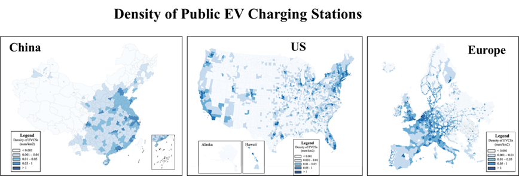

# Global Public Electric Vehicle Charging Station Data in 2024

We are glad to share the Global Public Electric Vehicle Charging Station Data in 2024, which contain public EV charging station locations in the US, China and Europe. 

> *Global Public Electric Vehicle Charging Station Distribution in 2024*

- For the US, we collected the location data of 69,677 EVCSs (with a sample rate of around 100%) from the Alternative Fuels Data Center.
- For China, we collected the location data of 159,199 EVCSs (with a sample rate of 69.15%) from the AMAP, one of the largest online mapping service providers in China.
- For Europe, we collected the location data of 226,253 EVCSs (with a sample rate of 69.56%) from the European Alternative Fuels Observatory and Open Charge Map.

You can download the sample data and request the full datasets through our Data Sharing Initiative: see [here](/data). 

> Posted on 19 March 2025 by Zhiqing Pan

