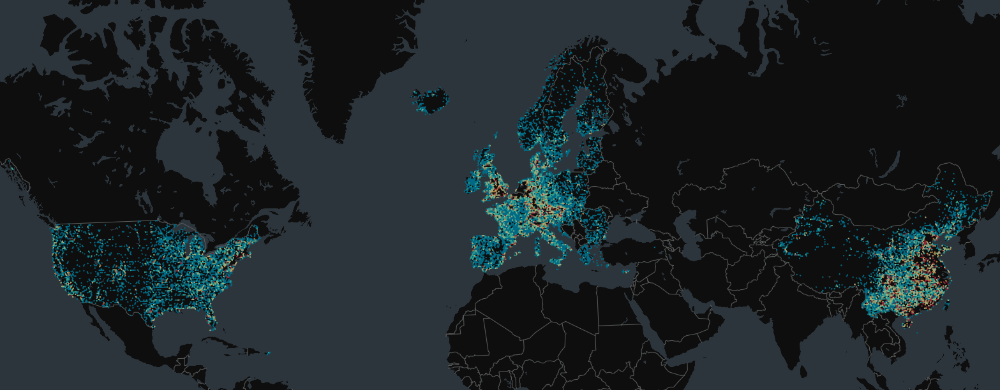

# Presentations on Global EV Data Initiative at University of Cambridge

The Principal Investigator of the Global EV Data Initiative, Dr. Chengxiang (Tony) Zhuge was invited by Prof Ying Jin and Dr Li Wan to give two talks at the Architecture and Land Economy departments, University of Cambridge on 30 April and 1 May 2025. The talks gave an overview of the Global EV Data Initiative, as well as four case studies using the datasets from the initiative. The case studies include advanced air mobility, and global EV charging station location and charging services.The Principal Investigator of the Global EV Data Initiative, Dr. Chengxiang (Tony) Zhuge was invited by Prof Ying Jin and Dr Li Wan to give two talks at the Architecture and Land Economy departments, University of Cambridge on 30 April and 1 May 2025. The talks gave an overview of the Global EV Data Initiative, as well as four case studies using the datasets from the initiative. The case studies include advanced air mobility, and global EV charging station location and charging services.

> *Tony Zhuge at University of Cambridge*
