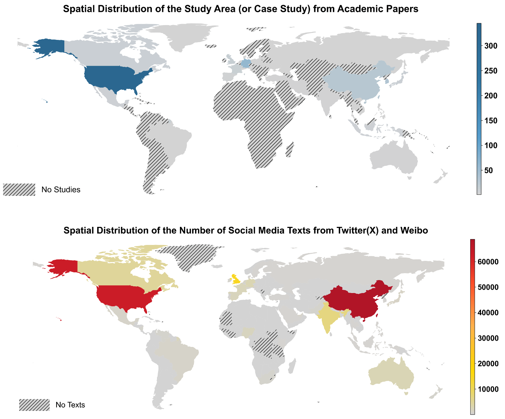

# Advanced Air Mobility (AAM)-related Social Media and Bibliometric Text Data (2015-2024)

> Posted on 3 July 2025 by Zhiqing Pan

We are excited to share Advanced Air Mobility (AAM)-related text datasets from 2015 to 2024, covering social media and bibliometric text data. On one hand, social media text data, collected from Twitter/X and Sina Weibo using Python crawlers, includes text posts on keywords, i.e., AAM, eVTOL, urban air mobility, and drone taxis, with detailed attributes, i.e., User ID, Nation, Sentiment, Topic, and Theme (passenger- or freight-AAM). On the other hand, bibliometric abstract text data, sourced from Scopus and Web of Science, covers peer-reviewed articles and conference proceedings, including abstracts with topic analyses. These rich datasets support research and analysis of AAM trends worldwide. 

> *Figure 1: Advanced Air Mobility (AAM)-related Social Media and Bibliometric Text Data*

You can download the sample data and request the full datasets which has been used in our research through our Data Sharing Initiative: see [here](/data.html#_3-advanced-air-mobility-aam-social-media-text-data-2015-–-2024)