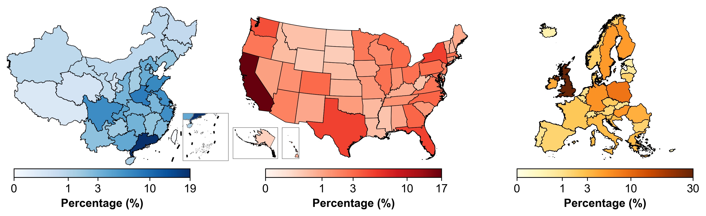

# Global EV Public Charging Station Review Data (2015-2024)

> Posted on 17 August 2025 by Zhiqing Pan

We are pleased to present the Global EV Charging Station Review Dataset (2015–2024). Covering the period from 1 January 2015 to 31 December 2024, the dataset compiles geo‑location and real-world user review data from Baidu Maps and PlugShare for 287,193 charging stations in mainland China, 61,631 in the USA, and 185,480 in Europe (defined as the 27 EU member states plus the United Kingdom, Norway, Liechtenstein, Iceland, and Switzerland). This holistic source offers valuable insights to support research and analysis on EV charging infrastructure and development trends worldwide.

> *Spatial distributions of EV public charging station reviews from 2015 to 2024*

You can download the sample data and request the full datasets which has been used in our research through our Data Sharing Initiative: see [here](/datasets/ev-text/ev-charger-review)
