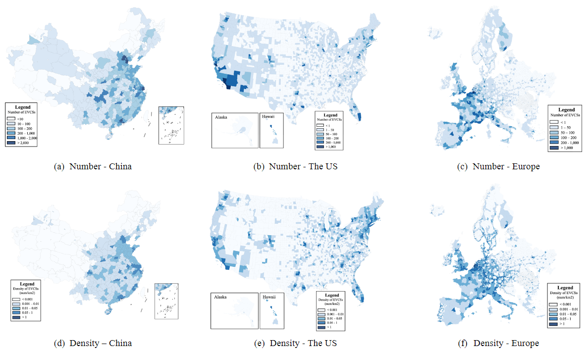
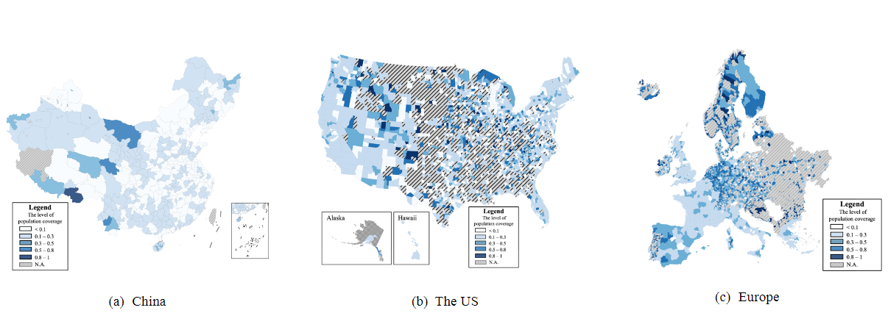
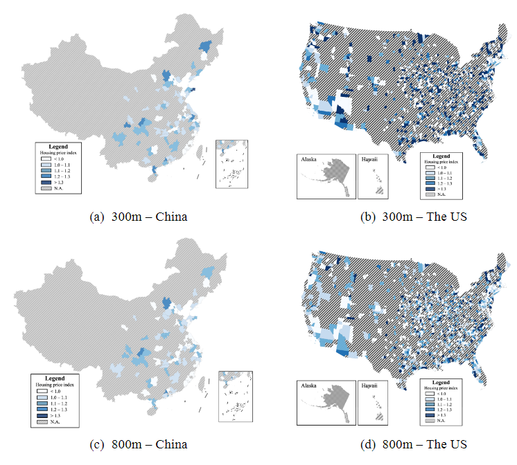
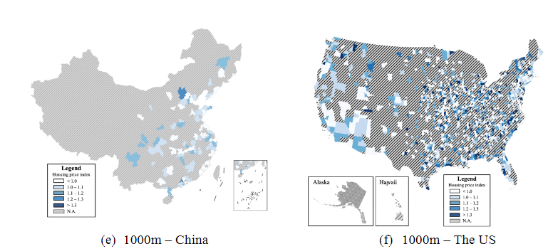
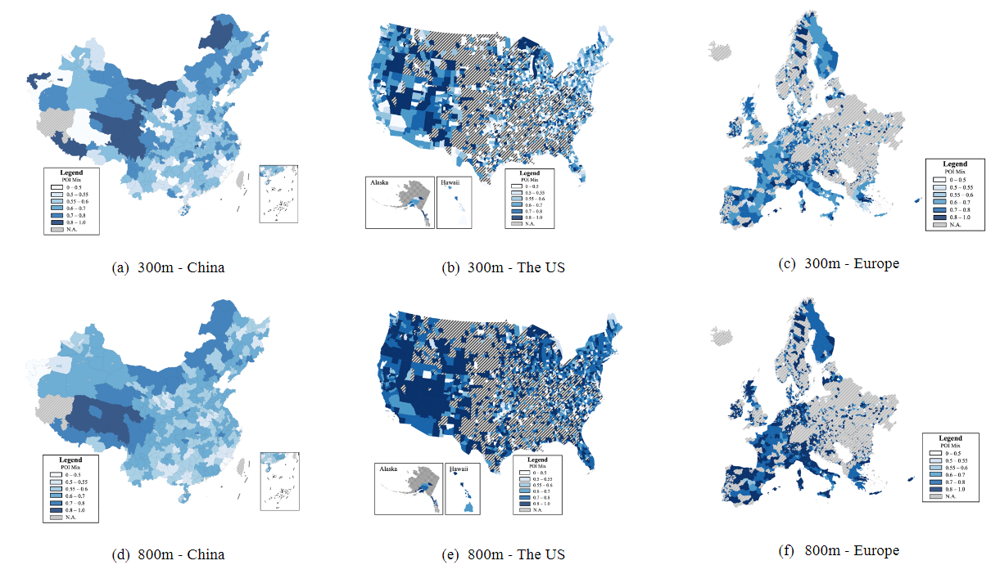
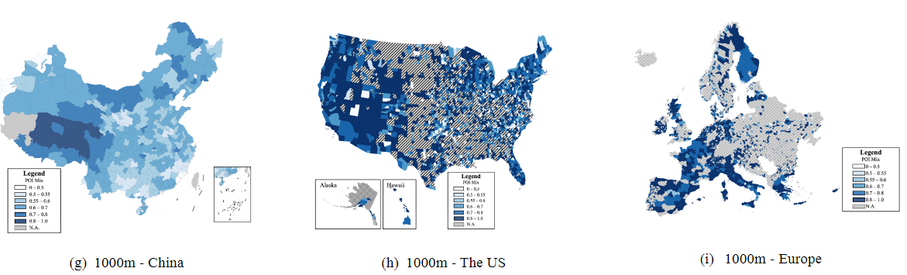

# Where Are Public Electric Vehicle Charging Stations Located Globally? Insights from a Spatial Planning Perspective ?

## Appendix A: Spatial Distributions of EVCSs   

Figure A-1 shows the spatial distributions of EVCSs across the three study areas, and further Figure A-2 shows the number/density distributions of EVCSs at the city level. It can be found that for all the three study areas, more and/or denser EVCSs tend to be deployed in the specific well-known city-clusters. 

Fig. A-1 The spatial distributions of EVCSs across the three study areas

Fig. A-2 The spatial distributions of EVCSs at the city level across the three study areas 
 
## Appendix  B:  Regression  Results  of  the  Associations  between  EVCS Number/Density and GDP

Tables B-1 and B-2 show the detailed regression results of the associations between EVCS number/density and GDP. It can be found that the positive relationship between EVCS number and GDP tends to be more significant compared to the positive relationship between EVCS density  and  GDP,  as  indicated  by  the  performance  indicator  R2.  Furthermore,  the  stronger positive correlations between EVCS number and GDP can be observed in the US and Europe compared to China, as indicated by the estimated coefficient for each study area. 

Tabel B-1 Regression results of the association between EVCS number and GDP 
| Association | Region | Intercept | Coefficient | R2 | AIC | BIC |
| --- | --- | --- | --- | --- | --- | --- |
| EVCS Number-GDP | US | -370.026 | 2.584 | 0.750 | 848.226 | 852.189 |
| | Europe | 525.439 | 3.903 | 0.551 | 612.055 | 615.068 |
| | China | -298.441 | 0.684 | 0.786 | 526.224 | 529.010 |

 
Tabel B-2 Regression results of the association between EVCS density and GDP 
| Association | Region | Intercept | Coefficient | R2 | AIC | BIC |
| --- | --- | --- | --- | --- | --- | --- |
| EVCS Density-GDP | US | 0.008 | 5.877 | 0.036 | -253.798 | -249.857 |
| | Europe | 0.046 | 5.333 | 0.002 | -49.542 | -46.618 |
| | China | 0.033 | 4.421 | 0.012 | -38.069 | -35.194 |

## Appendix C: Spatial Distributions of the Level of Population Coverage of EVCSs at the City Level 

Figure C-1 shows the spatial distributions of the level of population coverage of EVCSs at the city level across the three study areas. It can be found that, in general, for those cities with more EVCSs, EVCSs tend to be deployed in those areas with a lower population density. 

Fig. C-1 The spatial distributions of the level of population coverage of EVCSs at the city level across the three study areas

## Appendix D: Spatial Distributions of the Housing Price Index of EVCSs at the City Level

Figure D-1 shows the spatial distributions of the housing price index of EVCSs at the city level across the two study areas (i.e., China and the US) and different buffer radii. It can be found that for most cities in both China and the US, the values of housing price index are close to each other (fluctuating around 1), while the US has a wider variation range.

Fig. D1 The spatial distributions of the housing price index of EVCSs at the city level across the two study areas and different buffer radii   

## Appendix E: Spatial Distributions of the POI Mix of EVCSs at the City Level 

Figure E-1 shows the spatial distributions of POI Mix of EVCSs at the city level across the three study areas and different buffer radii. It can be found that for most cities in the three study areas, they tend to have a high POI Mix of EVCSs, while more cities in the US and Europe tend to have a higher POI Mix of EVCSs compared to China when the buffer radii are 800m and 1000m. 

Fig. E-1 The spatial distributions of the POI Mix of EVCSs at the city level across the three study areas and different buffer radii 

## Appendix  F:  Spatial  Distributions  of  Access  to  EVCSs  through  Road Network at the City Level 

Figures F-1 and F-2 show the spatial distributions of road network density and the relative development level of road network around EVCSs at the city level across the three study areas and different buffer radii. It can be found that road network density around EVCSs in Chinese cities tend to be lower compared to the US and Europe. Meanwhile, in terms of the relative development level of road network, cities in China and the US tend to have a greater variability compared to Europe.

 

 
 
