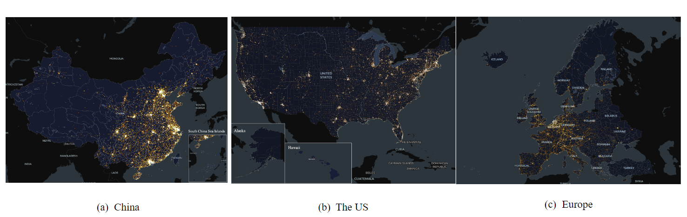

# Maps

<!--  -->

<!-- ## [Spatial Distributions of EVCSs](./AB.md)
> the spatial distributions of EVCSs across the three study areas. -->

## [Spatial Distribution of EV Charging Stations (EVCSs) in 2022](./AB.md)

## [Population Coverage of EV Charging Stations (EVCSs) in 2022](./C.md)

> The spatial distributions of the level of population coverage of EVCSs at the city level across China, the US, and Europe. It can be found that for most cities in the our study areas, they tend to have a low level of population coverage of EVCSs.

Interactive Map : [Click Here](./C.md)

## [Housing Price around EV Charging Stations (EVCSs) in 2022](./D.md)

> The spatial distributions of the housing price index of EVCSs at the city level across China and the US with different buffer radii. It can be found that for most cities in both China and the US, the values of housing price index are close to each other (fluctuating around 1), while the US has a wider variation range.

Interactive Map : [Click Here](./D.md)

## [The Built Environment around EV Charging Stations (EVCSs) in 2022](./E.md)

> The spatial distributions of POI Mix of EVCSs at the city level across China, the US, and Europe with different buffer radii. It can be found that for most cities in our study areas, they tend to have a high POI Mix of EVCSs, while more cities in the US and Europe tend to have a higher POI Mix of EVCSs compared to China when the buffer radii are 800m and 1000m.

Interactive Map : [Click Here](./E.md)

## [Access to EV Charging Stations (EVCSs) through Road Network in 2022](./F.md)

> The spatial distributions of road network density and the relative development level of road network around EVCSs at the city level across China, the US, and Europe with different buffer radii. It can be found that road network density around EVCSs in Chinese cities tend to be lower compared to the US and Europe. Meanwhile, in terms of the relative development level of road network, cities in China and the US tend to have a greater variability compared to Europe.

Interactive Map : [Click Here](./F.md)